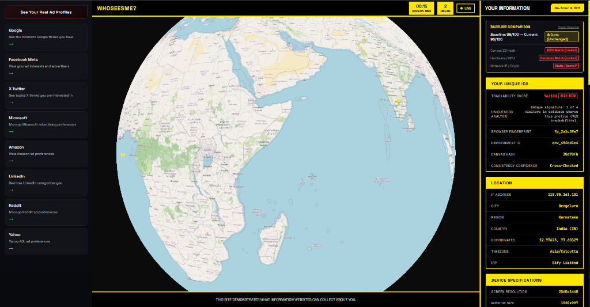

# WhoSeesMe

[](https://who-sees-me.vercel.app/)
[](https://turso.tech)
[](https://cesium.com/)

A real-time browser privacy and fingerprinting diagnostic dashboard. WhoSeesMe reveals the extensive telemetry and hardware markers modern websites can passively extract from your browser without requesting a single permission.



---

## Key Features

### Statistical Uniqueness & Entropy Scoring
Computes a real-time trackability index (0–100) by evaluating multi-dimensional entropy across visitor telemetry against all records in a distributed Turso database. Identifiers analyzed include:
- Canvas 2D render geometry & winding noise
- WebGL unmasked vendor and renderer strings
- Audio buffer hash and dynamic compression curves
- Hardware concurrency and device memory profiles
- Screen color depth, pixel ratio, and available desktop coordinates

### VPN & Session Diffing
Stores session baselines in memory to compare device telemetry before and after toggling a VPN or proxy. Demonstrates how persistent hardware and canvas markers track user identity across IP and ISP changes.

### Biometric Kinematics Oscilloscope
A real-time HTML5 canvas oscilloscope that graphs mouse velocity, acceleration curves, and movement cadence to illustrate passive behavioral biometric profiling.

### Interactive 3D Cesium Globe
Plots user network endpoints and connection nodes on an interactive CesiumJS globe with dynamic orbital panning and coordinates telemetry.

### Non-Invasive Passive Auditing
All diagnostic metrics are acquired using standard web APIs without triggering system permission dialogs or intrusive prompts.

---

## Tech Stack

- **Frontend**: Vanilla ES6+ JavaScript, HTML5 Canvas, CSS3, Cesium.js, Space Grotesk & JetBrains Mono
- **Backend**: Node.js, Express
- **Database**: Turso Cloud (LibSQL / distributed SQLite)
- **Deployment**: Vercel Serverless

---

## Getting Started

### Prerequisites
- Node.js 18 or newer
- Turso CLI or a free Turso Cloud account

### Environment Configuration
Create a `.env` file in the root or `Backend/` directory:

```env
PORT=3000
TURSO_DATABASE_URL=libsql://your-database-name.turso.io
TURSO_AUTH_TOKEN=your-turso-auth-token
```

### Installation

```bash
# Clone the repository
git clone https://github.com/iokuru/WhoSeesMe.git
cd WhoSeesMe

# Install backend dependencies
npm install

# Start the local development server
npm start
```

Open `http://localhost:3000` in your browser.

---

## Project Structure

```
WhoSeesMe/
├── assets/             # Project screenshots and visual assets
├── api/                # Vercel serverless function entrypoints
├── Backend/            # Express API server and Turso database connection
│   └── server.js
├── Frontend/           # Client application
│   ├── index.html      # Dashboard markup
│   ├── script.js       # Fingerprinting, Cesium globe & telemetry logic
│   └── style.css       # Responsive HUD styling and theme
├── package.json
└── vercel.json         # Serverless routing and static redirects
```

---

## Ethical Disclosure

WhoSeesMe is built purely for educational and privacy-research purposes. Its objective is to raise awareness around digital privacy, browser fingerprinting techniques, and the limitations of relying solely on IP-masking tools like VPNs.
